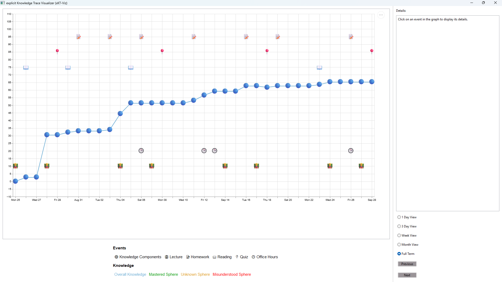
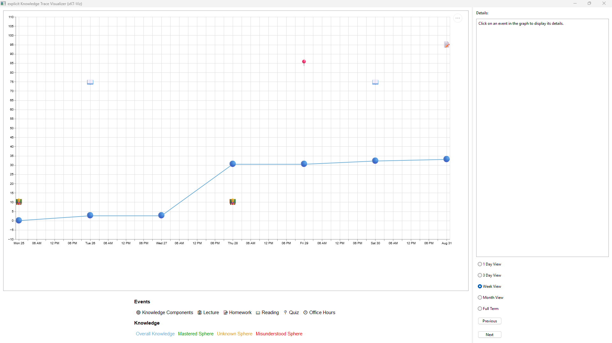
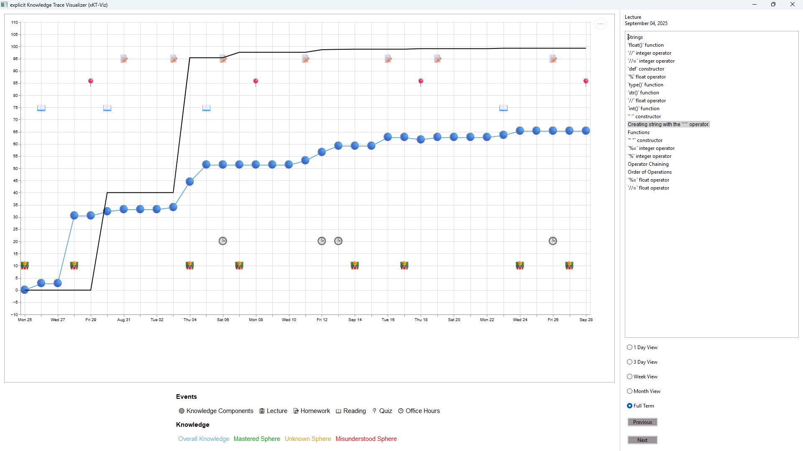
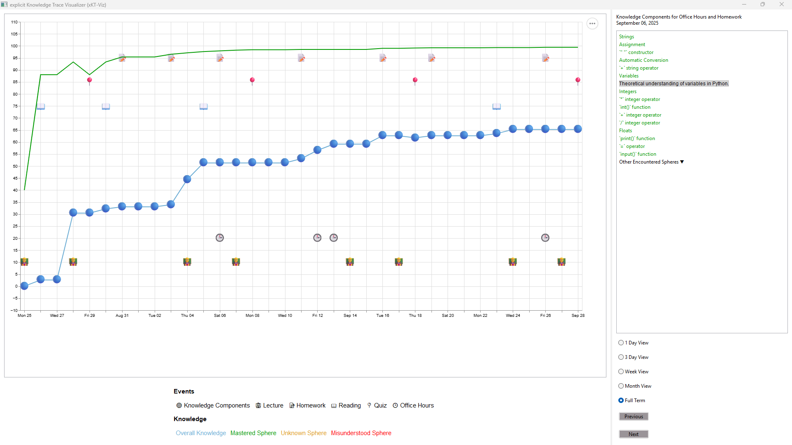
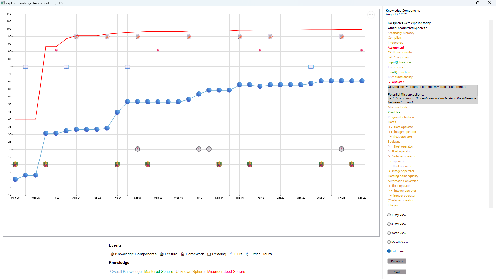
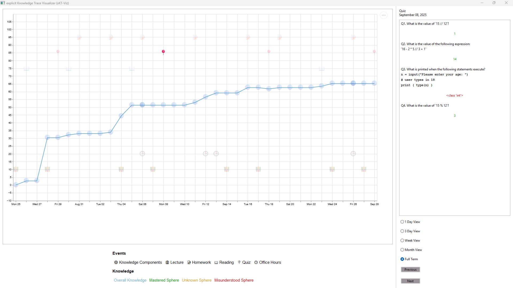

# explicit Knowledge Trace Visualizer (xKT_Viz)
Created by Daniel Mendoza with mentorship of Justin Smith and Razvan Bunescu.

University of North Carolina at Charlotte, College of Computing and Informatics

## Abstract/Description
Student knowledge traces provide an explicit representation of what a student knows as they progress through a course. Knowledge traces are complex and rich in information, containing student interactions with course materials, levels of mastery of course topics, and potential misconceptions.

In this work, we introduce explicit Knowledge Tracing Visualizer (xKT-Viz), an interactive visualization tool that displays a student’s interactions with course materials, the percentage of the course topics they have mastered at a given point in time, and their performance on assessments.

Users are able to display the student’s confidence for each topic, their misconceptions, and performance on quizzes and homework. Users are also able to zoom in on certain portions of the course, allowing for more focused analyses.

We evaluate the effectiveness of xKT-Viz for data analysis by utilizing it to display synthetic knowledge tracing data, since no large-scale data exists for this task. The visualization integrates a knowledge graph of introductory computer science (CS1) topics, which provides descriptions of knowledge components and misconceptions, together with their relationships with student answers to questions on quizzes or homework assignments.

When completed, the xKT-Viz tool will allow educators to more easily explore the fine-grained behavior of a student in a CS1 course, which in turn will enable them to derive personalized education strategies for that student’s success.

## Getting Started
### Installation
First, change your directory to the project's root directory called "xKT-Viz".

Included in this project is a "requirements.txt" file, which includes all necessary packages to run the visualizer. Make sure to use a pip install command with this file as such:
```
pip install -r requirements.txt
```

You will also find a "viz_config.ini" file, which is used to set the start_date variable. This should be treated as the start of a semester or term, and you can edit it to whatever date fits. Make sure it is in the format MM/DD/YYYY.

To run the project, run this command:
```
python -m code.main
```

### Main User Interface


### Functionality
1. Provide the terminal input with the trace you want to visualize. As of now, the input must be an integer between 1 and 1000. This is because there are 1000 available traces in the data\example folder. This single input will take care of identifying both the necessary trace .csv and .md files. Keep in mind, each 100 traces (ie. 1-100, 101-200, etc.) is a different type of prototypical student, which is why some visualizations will look far different than others.

2. At this point, you will see the main user interface. The main component is the graph, which includes an accompanying legend underneath that explains what each icon and line means. The x-axis is the dates in the semester. The y-axis is a percentage of knowledge, 0-100. By default, the graph includes the icons as events (student interactions with course material) and overall knowledge (percentage of mastery in all course topics). Zoom in on the graph using the scroll wheel. Pan across the graph by clicking and dragging. Double click to return to the default view, which is determined by your view option (see next step).



3. The details panel next to the graph has two main sections. Details describes a selected event (see next step), while the view options underneath provide different graph setups. "1 Day View" will display one day. "3 Day View" will display three, "Week View" will display seven, and "Month View" will display thirty-one. "Full Term," the default choice, shows the entire semester. You can drag the bar between the graph and details panel to resize them as needed.



4. Hover over any of the graph icons to see the event they represent and when it occurred. Click the icon to see more information, which is displayed in the details panel's text. The label above the text box also changes to the event title and the date of occurrence.

5. Clicking on a Lecture, Reading, or Office Hours event reveals all relevant course topics of that event. You can then click on these topics to reveal a description of the topic and an update to the graph with the student confidence in that topic over the term. This is a percentage representation of the student's understanding for that topic.



6. Clicking on a Knowledge Components event reveals all relevant course topics at that date, color coded accordingly to their level of understanding (see the legend). Like in the last step, you can click on these topics to reveal a description and an update to the graph with the student confidence in that topic. If you select a misunderstood sphere, you will also see potential misconceptions that the student holds about that topic under the topic description.
Other than the first knowledge components instance, you will also find "Other Encountered Spheres" with a dropdown indicator at the bottom of the text. Clicking on this will reveal topics that were not exposed that day, but have been encountered previously.





7. Clicking on a Quiz or Homework event reveals questions answered by the student at that time. Underneath all questions is the answer provided by the student. These answers will be green if correct and red if incorrect. NOTE: You may also see that some homework events have identical questions. This is as intended, because the student can attempt the homework multiple times.



## Future Work
1. Improvement of Quiz and Homework Descriptions
1. Next and Previous Buttons
1. File Tab for Choosing Traces
1. Aggregate Traces and Events

### 

## License
Distributed under the GPL-3.0 license. See LICENSE for more information.

## Contact
Daniel Mendoza, Undergraduate Research Scholar - dmendo11@charlotte.edu

LinkedIn: https://www.linkedin.com/in/daniel-mendoza24/

Project Link: https://github.com/dmendoza-24/xKT-Viz

## Acknowledgments
Justin Smith, UR2PhD Advisor - jsmit840@charlotte.edu

Razvan Bunescu, Faculty Mentor - razvan.bunescu@charlotte.edu